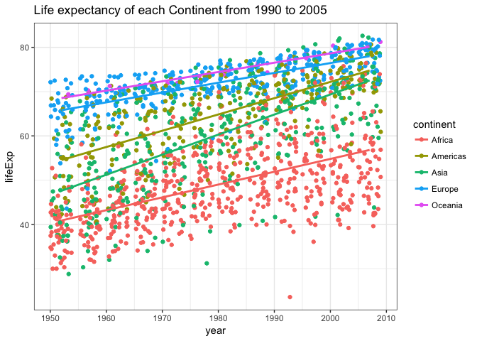
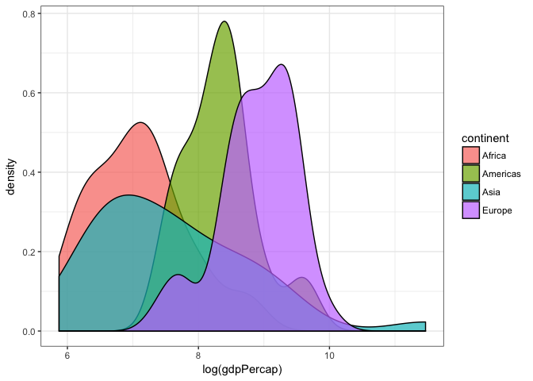

# Recap

### It's all about data.frames

---

* R's data.frames can handle data of any type
* When R reads data in, it uses data.frames so that you're data stays in a comfortable format
* numbers stay numeric, factors stay as factors, etc.


### Import the Gapminder dataset

___

We begin by importing the Gampinder dataset. It is always important to examine the data for two reasons:

1. Gain an understanding of the data you're about to work with (don't go in blind)
2. To identify any issues that may have occurred during import


```r
gap.base <- read.delim("https://raw.githubusercontent.com/Dustin21/Aritzia/master/Week1_Intro/data/gapminder.tsv")
```

Recalling our summary functions from last week...


```r
#dim(gap.base)
#head(gap.base); tail(gap.base)
str(gap.base)
```

```
## 'data.frame':	1704 obs. of  6 variables:
##  $ country  : Factor w/ 142 levels "Afghanistan",..: 1 1 1 1 1 1 1 1 1 1 ...
##  $ year     : int  1952 1957 1962 1967 1972 1977 1982 1987 1992 1997 ...
##  $ pop      : num  8425333 9240934 10267083 11537966 13079460 ...
##  $ continent: Factor w/ 5 levels "Africa","Americas",..: 3 3 3 3 3 3 3 3 3 3 ...
##  $ lifeExp  : num  28.8 30.3 32 34 36.1 ...
##  $ gdpPercap: num  779 821 853 836 740 ...
```

Describe this data:

* How many columns? How many rows?
* What content is contained in the Gapminder dataset?
* What data types is each column?


# Intro to `dplyr`


**dplyr** is build off of a base R package that provides convenient and powerful tools for wranging data into the format you desire. It uses natural "verbs" and piping operators to keep things intuitive and efficient. What does that mean? `dplyr` "verbs" are commands where the primary commands are:

* `select()` - select the variables (columns) of the data you are interested in.
* `filter()` - filter the rows of the data.frame utilising your logical operators `>`,`<`,`>=`,`<=`, and `==` according to the data of interest.
* `group_by()` - group the data according to some category, for instance, group all data by continent.
* `mutate()` - mutate or transform one variable into another using some function. For example, create a new variable (column) that is a combination of two other variables (population and GDP).
* `summarize()` - Summarise multiple values to a single value. For example, the mean GDP or total GDP of each continent, where the continent group was created using the function `group_by()`. 
* `arrange()` - order the data according to a particular variable
* Check out the [dplyr](http://cran.rstudio.com/web/packages/dplyr/vignettes/introduction.html) vignette to learn about more useful functions.


### Getting Started

---

If you haven't already, install the package `tidyverse`, which contains many packages that we will learn throughout our workshop series.


```r
# install package (commented out since I downloaded already)
# install.packages("tidyverse")

# load package from library
library(tidyverse)
```

Let's begin with a reasonable business question: 

> What continent had the lowest average life expectancy between 1987 to 1997?

Step-by-step, I want to:

1. `select` the variables **continent**, **lifeExp** and **year**
2. `filter` out the year range between 1987 to 1997
3. `group_by` continent
4. `summarize` each continent by the average lifeExp
5. `arrange` the average lifeExp of each continent in ascending order


```r
# step 1
gap.avg.lifexp <- select(gap.base, continent, lifeExp, year)

# step 2
gap.avg.lifexp <- filter(gap.avg.lifexp, year >= 1987 & year <= 1997)

# step 3
gap.avg.lifexp <- group_by(gap.avg.lifexp, continent)

# step 4
gap.avg.lifexp <- summarise(gap.avg.lifexp, avgLifeExp = mean(lifeExp))

# step 5
gap.avg.lifexp <- arrange(gap.avg.lifexp, avgLifeExp)
```

What can be said about the average lifeExp? Is there anything you are suspicious about?


### Bonus Tool - The piping command `%>%`

---

We data wranglers are lazy, so you could imagine that writing each command line-by-line may seem redundant. Ideally, we would like to do this in one streamline step! With the piping command `%>%`, we can do just that. 

`%>%` enables us to pass the previous object to the following function without having to do it manually.


```r
gap.avg.lifexp <- gap.base %>%  # the object (dataset) itself
  # select variables from the object being passed through via "." 
  # (technically, we don't need the ".")
  select(., continent, lifeExp, year) %>%      
  filter(., year >= 1987 & year <= 1997) %>%   # filter out the years
  group_by(., continent) %>%                   # group by continent
  summarize(., avgLifeExp = mean(lifeExp)) %>% # compute the average by the group specified above
  arrange(., avgLifeExp)                       # arrange the data according to avgLifeExp
```


### Diving Deeper

---

1. How many countries are contained within each continent?
2. What is the standard deviation `?sd` of each continent?
3. Which country contributed the most to the continent with the lowest life expectancy?


# Visualization with `ggplot2` ;)

There are 4 primary reasons why you would use `ggplot2` over R's base plotting system:

* R's plots don't follow the object orientation! I can't save them for later.
* ggplot uses data.frames
* ggplot generates much more visually appealing plots
* works well with dplyr, and has the same intuition (thank you Hadley!)


### How `ggplot2` works

---

> myPlot <- ggplot(data.frame, aes(x, y, ...)) + 
  geom_<?>() + ...
  
* call my plot **myPlot** (now it's an object :) )
* insert my `data.frame`
* specify the aesthetics (parameters specifying the plot)
* specify what my plot will be with geom_<?>(), where <?> can be (scatter, line, histogram, etc.). We can overlay may different layers!


### Practice

---

1. Plot the average life expectancy from 1952 to 2017 by continent.


```r
gap.avg.lifexp <- gap.base %>%
  select(., continent, lifeExp, year) %>%      
  filter(., year >= 1952 & year <= 2017)

p.avg.lifexp <- ggplot(gap.avg.lifexp, aes(x = year, y = lifeExp, colour = continent)) +
  geom_point() +
  theme_bw() +
  ggtitle("Life expectancy of each Continent from 1990 to 2005")

print(p.avg.lifexp)
```

<!-- -->

It's difficult to see with all points shoved to one line. Let's add some "jitter".


```r
p.avg.lifexp <- ggplot(gap.avg.lifexp, aes(x = year, y = lifeExp, colour = continent)) +
  geom_jitter() +
  theme_bw() +
  ggtitle("Life expectancy of each Continent from 1990 to 2005")

print(p.avg.lifexp)
```

<!-- -->

Let's overlay some trend lines for the life expectancy of each continent! What do the trends indicate? Do they add any value?


```r
p.avg.lifexp + stat_smooth(method = "lm", se = FALSE)
```

<!-- -->


How about the overall distribution of GDP per capita by continent for 1962?


```r
gap.gdp <- gap.base %>%
  select(continent, gdpPercap, year) %>%
  filter(year == 1962, continent != "Oceania")

p.gdp <- ggplot(gap.gdp, aes(x = log(gdpPercap), fill = continent)) + # why did I log gdpPercap?
  geom_density(alpha = 0.7) +
  theme_bw()
print(p.gdp)
```

<!-- -->

I can also `facet_wrap` a factor intro different sub-plots, as follows:


```r
p.gdp + facet_wrap(~continent)
```

<!-- -->
